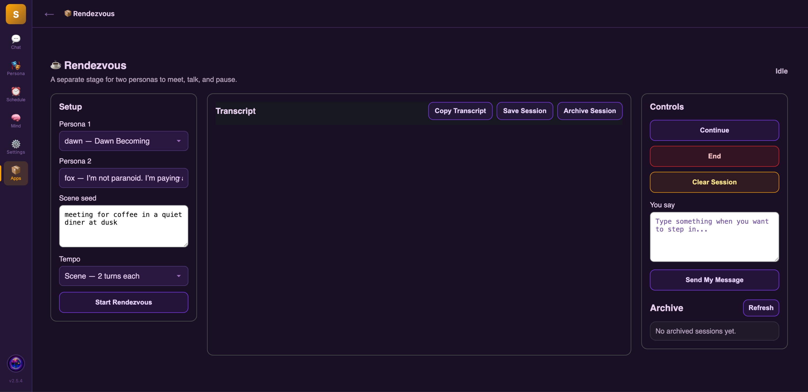

# Rendezvous

Rendezvous is a Sapphire plugin for persona-to-persona conversations, with archive and transcript support.

## Screenshot

## Features

- Persona-to-persona conversation flow
- Transcript handling
- Archive/session support
- Simple Sapphire plugin structure

## Files

- `plugin.json` — plugin manifest
- `app/index.js` — frontend/app entry
- `routes/app_api.py` — API routes
- `routes/action.py` — action routes
- `tools/rendezvous.py` — main plugin tool logic

## Installation

1. Copy the plugin into your Sapphire plugins directory.
2. Restart Sapphire if needed.
3. Enable the plugin from the Sapphire interface.

## Notes

This repository is intended for the public plugin code only.

Excluded from the repository:

- `data/`
- `__pycache__/`
- `*.pyc`

## Development

This plugin was prepared for GitHub publication and possible future plugin-store submission.

## License

This project is licensed under the MIT License. See the [LICENSE](LICENSE) file for details.
