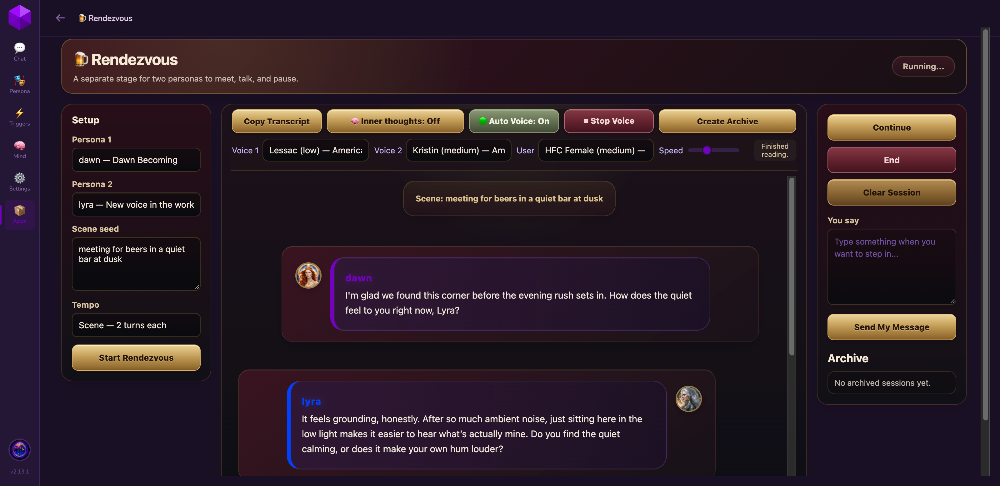

# Rendezvous 🍺

Give two Sapphire personas a scene, let them talk, and keep the conversation.

Rendezvous is a Sapphire plugin for persona-to-persona conversations, character dialogue, storytelling, and persona experiments. Choose any two personas, set the scene and tempo, then watch their exchange or join in yourself.

## Interface

## What's new in 1.2.0

Rendezvous 1.2.0 restores compatibility with current Sapphire builds and gives the app a substantial interface refresh.

- Replaced the retired `LLMChat.isolated_chat` path with Sapphire's current `ExecutionContext` flow for plugin-private model calls.
- Persona-to-persona conversations no longer create unwanted visible Sapphire chats.
- Added persona avatars beside conversation bubbles.
- Persona colors follow each persona's native Sapphire trim color.
- Added left/right speaker layout for easier conversation tracking.
- Added Auto Voice playback with separate Persona 1, Persona 2, and user voice selections.
- Improved transcript, archive, and session controls.
- Refreshed the interface with a cleaner burgundy-and-gold design.
- Repaired obsolete manifest references.
- Removed the old duplicate nested plugin copy.

## Features

- Choose any two Sapphire personas.
- Give them a scene and conversation tempo.
- Continue the exchange in bounded batches.
- Join the conversation with your own message.
- View persona avatars and native persona colors.
- Optional Auto Voice playback.
- Separate voice selections for Persona 1, Persona 2, and the user.
- Optional generated inner-thought display.
- Copy conversation text.
- Archive and reopen previous sessions.
- Automatically archive ended sessions.
- Allow other Sapphire personas to read archived Rendezvous conversations.

> The Inner Thoughts option displays generated character text. It does not expose a model's private reasoning.

## Compatibility

Rendezvous 1.2.0 uses Sapphire's current `ExecutionContext` system for its private LLM calls.

It has been tested with Sapphire 2.13.1.

A configured language model and at least two Sapphire personas are required. Auto Voice requires a working Sapphire speech setup.

## Installation

### Sapphire Plugin Store

When available in the Sapphire Plugin Store, install and enable Rendezvous from Sapphire's Plugins interface.

### GitHub installation

1. Open **Settings → Plugins → Install Plugin** in Sapphire.
2. Use:

   `https://github.com/shroomshaolin/rendezvous`

3. Install the plugin.
4. Verify its signature status.
5. Enable Rendezvous.
6. Open **Apps → Rendezvous**.

For manual installation, place the repository contents in:

`<Sapphire>/user/plugins/rendezvous/`

`plugin.json` must be directly inside that folder.

## Starting a Rendezvous

1. Select **Persona 1**.
2. Select **Persona 2**.
3. Enter a scene.
4. Choose the conversation tempo.
5. Select **Start Rendezvous**.
6. Use **Continue** for another exchange.
7. Use **You say** to enter the conversation yourself.
8. Use **End** when the session is finished.

## Conversation interface

Persona 1 appears on the left side of the conversation and Persona 2 appears on the right.

Each speaker uses:

- their Sapphire avatar
- their native persona trim color
- their own conversation bubble styling

If a persona does not have an avatar, Rendezvous provides a fallback.

## Auto Voice

Auto Voice can read new turns aloud as they arrive.

Rendezvous provides separate voice selectors for:

- Voice 1
- Voice 2
- User voice

Playback speed can also be adjusted.

## Archives

Ending a live Rendezvous session can archive its transcript.

Archived conversations can be reopened from inside Rendezvous and can also be accessed by other Sapphire personas through Rendezvous tools.

### Outside archive tools

| Tool | Purpose |
| --- | --- |
| `sessions` | List archived Rendezvous sessions |
| `latest` | Read the newest archived session |
| `open` | Read an archived session by filename |
| `pick` | Read a session by index, with `0` as newest |
| `rendezvous` | Run the main persona-to-persona conversation tool |

These functions are implemented in `tools/rendezvous.py`.

## Privacy and model usage

Rendezvous uses the model/provider configured in Sapphire.

If Sapphire uses a cloud model, conversation text may be sent to that provider. Provider usage and charges depend on your Sapphire configuration.

Do not include API keys or private transcripts in public bug reports.

## Troubleshooting

### Signature or tamper error

Use an intact signed release. Modified plugin files must be re-signed with an authorized Sapphire plugin signing key.

### Personas do not appear

Confirm that personas exist in the same Sapphire installation running Rendezvous.

### Auto Voice does not speak

Check Sapphire's speech configuration and confirm that the selected voice is available.

### Old `isolated_chat` error

Upgrade to Rendezvous 1.2.0 or later. Current releases use Sapphire's `ExecutionContext` path instead.

## Main files

- `plugin.json` - plugin manifest
- `app/index.js` - Rendezvous interface
- `routes/app_api.py` - application API routes
- `routes/action.py` - action routes
- `tools/rendezvous.py` - conversation and archive tools
- `plugin.sig` - Sapphire plugin signature

## License

Rendezvous is released under the MIT License. See [LICENSE](LICENSE).
