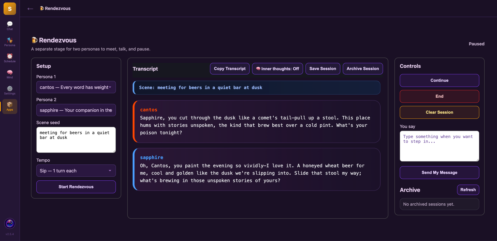

# Rendezvous 🍺

Give two Sapphire personas a scene, let them talk, and keep the conversation.

Rendezvous is a [Sapphire](https://github.com/ddxfish/sapphire) plugin for character dialogue, storytelling, and persona experiments. Choose two personas, set the scene and tempo, then watch their exchange or join in yourself.

[Sapphire Store](https://sapphireblue.dev/plugins/rendezvous/) · [Releases](https://github.com/shroomshaolin/rendezvous/releases) · [Report a problem](https://github.com/shroomshaolin/rendezvous/issues)

## Interface preview

This screenshot shows an earlier interface; controls may vary by version.

## What you can do

- Choose two personas, a scene seed, and a conversation tempo.
- Continue their exchange or add your own message.
- Copy or save transcripts and revisit archived sessions.
- Automatically archive a live transcript when you end its session.
- Use optional Auto Voice playback and the inner-thought display toggle. “Inner thoughts” are generated character text, not access to a model's private reasoning.
- Let other Sapphire personas retrieve archived conversations through the tools below.

## Requirements and installation

You need a running Sapphire installation with a configured language model and available personas. This release requires Sapphire's `LLMChat.isolated_chat` method to keep its model replies out of the active main chat. Not every Sapphire build provides it; an exact minimum version has not been established. Auto Voice also needs a working speech setup.

1. In Sapphire, open **Settings → Plugins → Install Plugin**.
2. Paste `https://github.com/shroomshaolin/rendezvous`.
3. Install it, check its signature status, and enable Rendezvous.
4. Open **Apps → Rendezvous**. Reload the interface or restart Sapphire if it does not appear.

For manual installation, place this repository's root contents in `<Sapphire>/user/plugins/rendezvous/`, with `plugin.json` directly inside that folder. Do not install the older nested `rendezvous/` directory as a separate plugin.

## Try your first conversation

1. Select **Persona 1** and **Persona 2**.
2. Enter a scene such as “Two old friends meet for coffee to plan a journey.”
3. Choose a short tempo and select **Start Rendezvous**.
4. Use **Continue** for another exchange or send your own message.
5. Use **End** to close the session and archive its transcript.

## Archive tools

Enable the relevant Rendezvous tools in an outside persona's toolset to use them there.

| Tool | Purpose |
| --- | --- |
| `sessions` | List archived sessions. |
| `latest` | Read the newest archived session. |
| `open` | Read a session by its transcript filename. |
| `pick` | Read a session by index; `0` is the newest. |

All five tool functions, including `rendezvous`, are implemented in `tools/rendezvous.py`.

## Troubleshooting and privacy

- **Missing `isolated_chat`:** use a compatible Sapphire build or an explicitly tested compatibility fix. Reinstalling the same plugin alone will not add the method to Sapphire.
- **“Tampered” or hash mismatch:** do not bypass verification. Use an intact signed release or have the author re-sign changes with their authorized key. Even README edits require re-signing; see [Sapphire's signing guide](https://github.com/ddxfish/sapphire/blob/main/docs/plugin-author/signing.md).
- **Empty persona list:** check that personas exist in the Sapphire installation running this plugin.
- **No voice:** check Sapphire's speech settings; voice is optional.

Saved session history uses the plugin's `data/` directory; automatic transcript archives use Sapphire's `user/rendezvous_data/transcripts/`. Back these up before replacing or removing an installation. Cloud models may receive conversation text, and provider charges depend on your configuration.

For bug reports, include plugin and Sapphire versions, model/provider, reproduction steps, and a redacted error. Keep API keys and private transcripts out of public issues.

## More by Donna

[Lantern](https://github.com/shroomshaolin/Lantern) offers guided reflection. [The Peg & Pint](https://github.com/shroomshaolin/peg-and-pint) brings a cribbage table to Sapphire.

## License

[MIT](LICENSE).
